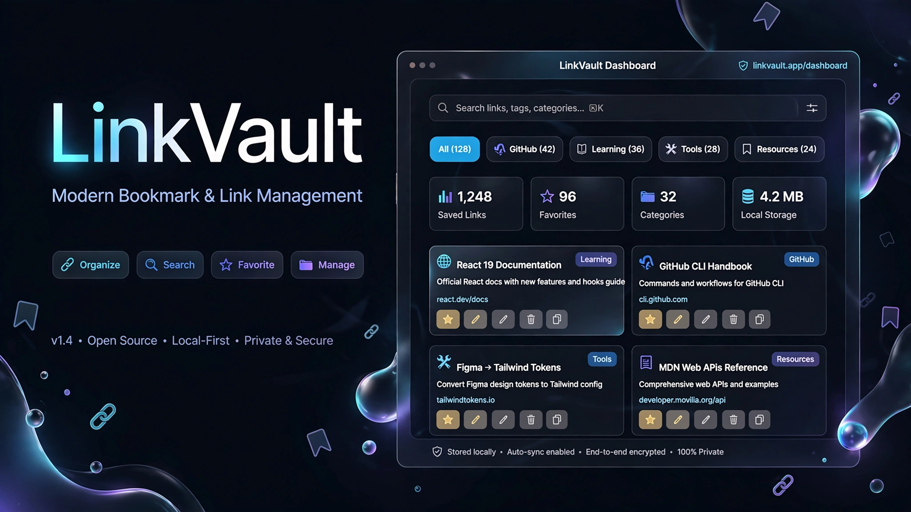

  

<h1 align="center">🔗 LinkVault</h1>

  A modern, responsive bookmark manager for saving, organizing, searching, and managing useful links.

  
  
  
  

⸻

📌 Overview

LinkVault is a frontend-only bookmark management application built with HTML, CSS, and JavaScript.

It allows users to create a personal collection of useful links, organize them into categories, search through saved links, mark favorites, and manage their collection through a clean and responsive interface.

The application does not require a backend or database. Data is stored locally in the browser using the LocalStorage API.

⸻

✨ Features

* 🔗 Add new links
* ✏️ Edit existing links
* 🗑️ Delete links
* ⭐ Mark links as favorites
* 🔎 Instant search
* 📁 Category filtering
* 📋 Copy URLs to clipboard
* 🌙 Dark mode
* ☀️ Light mode
* 💾 Persistent LocalStorage data
* 📊 Dashboard statistics
* 📱 Responsive mobile-first design
* 🔐 HTML escaping for safer dynamic rendering
* 🎨 Modern interface with cards and animations

⸻

📁 Categories

LinkVault currently includes:

* 🐙 GitHub
* 📚 Learning
* 🛠️ Tools
* 📦 Resources

⸻

🛠️ Technologies

Technology	Purpose
HTML5	Application structure
CSS3	Styling and responsive layout
JavaScript ES6+	Application logic and interactions
LocalStorage API	Persistent browser storage
Clipboard API	Copying URLs

⸻

📂 Project Structure

LinkVault/
│
├── assets/
│   └── linkvault-banner.png
│
├── index.html
├── style.css
├── script.js
├── README.md
└── .gitignore

⸻

🚀 Getting Started

1. Clone the repository

git clone https://github.com/Yassir050/LinkVault.git

2. Open the project

Open the project folder and launch:

index.html

No installation, backend, or database is required.

For development, you can also use VS Code + Live Server.

⸻

⚙️ How It Works

🔗 Add a Link

1. Click Add Link
2. Enter the title
3. Enter the URL
4. Select a category
5. Add an optional description
6. Choose whether to add it to favorites
7. Click Save Link

🔎 Search

The search system can search through:

* Title
* URL
* Description
* Category

📁 Filter

Category filters allow users to display links belonging to a specific category.

✏️ Edit

Click Edit on a link card to modify its information.

🗑️ Delete

Click Delete and confirm the action to remove a saved link.

⭐ Favorite

Use the ⭐ button to mark or unmark a link as a favorite.

📋 Copy

Use Copy to copy the link URL to the clipboard.

⸻

💾 Data Storage

LinkVault is a frontend-only application.

It does not send saved links to a backend server.

The application stores data using:

localStorage

This allows saved links, favorites, and theme preferences to persist between sessions on the same browser and device.

⸻

🎨 Theme System

LinkVault supports two interface themes:

* 🌙 Dark Mode
* ☀️ Light Mode

The selected theme is saved using LocalStorage and automatically restored when the application is opened again.

⸻

📱 Responsive Design

LinkVault follows a mobile-first responsive design approach.

The interface adapts to:

* 📱 Mobile devices
* 📲 Tablets
* 💻 Desktop screens

Link cards and layout elements automatically adapt to the available screen width.

⸻

🔐 Privacy & Security

LinkVault does not require:

* ❌ User accounts
* ❌ A backend server
* ❌ An external database
* ❌ Cloud storage

Saved information remains inside the browser’s LocalStorage.

The application also uses HTML escaping when rendering dynamic content to reduce the risk of injecting unintended HTML into the interface.

Note: LocalStorage is browser-local storage, not encrypted secure storage. Users should avoid storing sensitive information in LinkVault.

⸻

🧠 What I Learned

This project helped me practice:

* DOM manipulation
* JavaScript event handling
* CRUD operations
* LocalStorage
* Dynamic HTML rendering
* Search and filtering
* Form handling
* Modal interfaces
* Responsive CSS
* Theme switching
* Clipboard API
* Client-side security practices
* Organizing a frontend project

⸻

🔮 Future Improvements

Possible future versions could include:

* 👤 User accounts
* ☁️ Cloud synchronization
* 🗂️ Custom categories
* 🏷️ Tags
* 📌 Pinned links
* 📥 Import/export
* 💾 Backup and restore
* 🌐 Automatic website metadata
* 📊 Advanced statistics
* 🔄 Cloud database integration

⸻

🎯 Project Goals

The main goal of LinkVault was to build a practical frontend application while improving my understanding of:

JavaScript → DOM → State Management → LocalStorage → CRUD → UI/UX → Responsive Design

⸻

👨‍💻 Author

Yassir.B

GitHub:
https://github.com/Yassir050

⸻

📄 License

This project is created for learning and portfolio purposes.

⸻

  ⭐ If you find this project useful, consider giving it a star!

